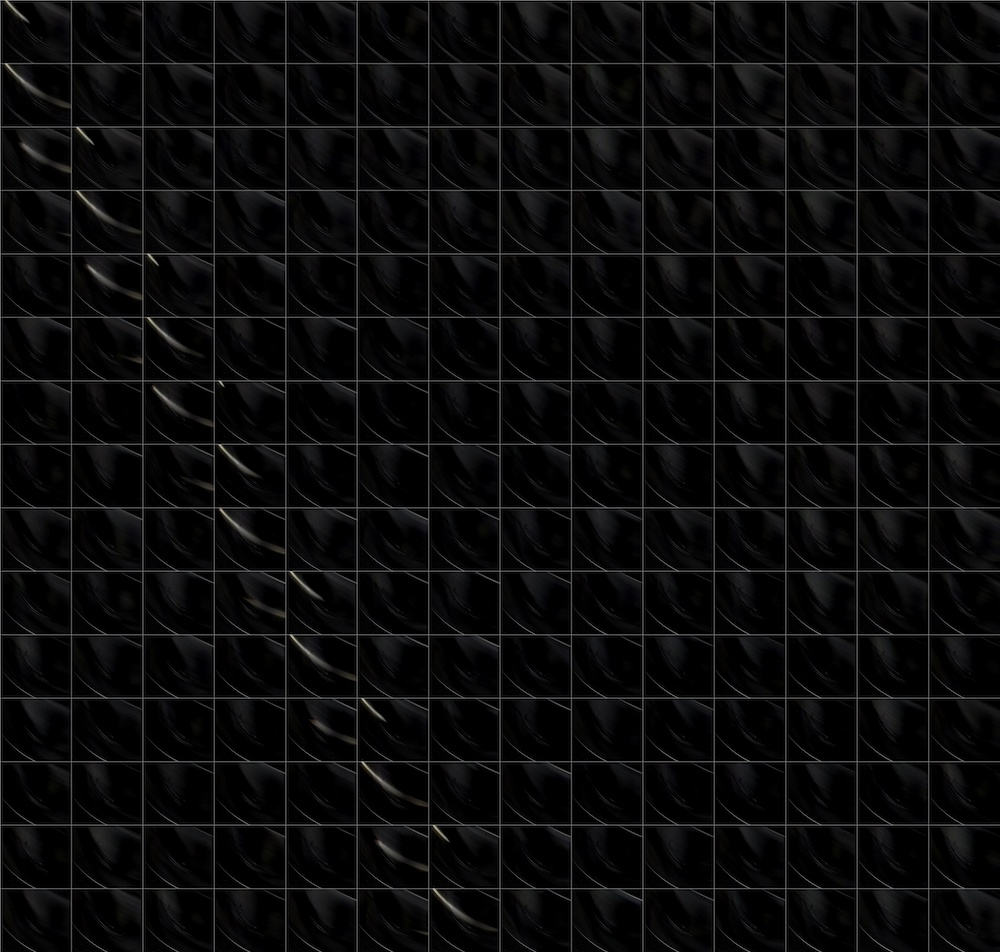

I have a [Blueair Blue 3410 Air Purifier](https://www.blueair.com/gb/blue/pure-311-auto/8319.html),
but the technical specifications are quite sparse - for example they don't specify how fast the fan spins at each of the three speed settings.
This can be quite important because to know how effective the purifier will be we need to know the CADR (Clean Air Delivery Rate), but it's only
quoted for the highest speed setting which is too loud to be used continuously.

The CADR divided by the volume of the room will give the ACH (Air Changes per Hour), and from that we can calculate the relative purification over
time using the [room purge equation](https://en.wikipedia.org/wiki/Dilution_(equation)#Basic_room_purge_equation). For the plots below I've used a
mixing factor of 1.5 to account for imperfect mixing of the air. Note that these calculations also assume no additional pollutant is being added.

However, with a smartphone and some [Python code](https://github.com/daniel-wells/danielwells.me/blob/main/content/posts/air-purifier-rpm-audio-signal-analysis/infer_fan_rpm.py) we can work out the fan speed ourselves!
There are two ways I can think of:
 - Counting the time of each rotation using "high speed" video recording (effectively recreating an optical tachometer)
 - Looking for the relevant frequency in an audio recording of the fan.

### "High speed" Video Analysis

My [Pixel 3a](https://support.google.com/pixelphone/answer/7158570?hl=en-GB#) smartphone can record video at 240 fps which should be able to resolve a signal up to around 120 Hz (7,200 rpm) by the [Nyquist–Shannon sampling theorem](https://en.wikipedia.org/wiki/Nyquist%E2%80%93Shannon_sampling_theorem).

The fan itself has multiple blades but on one of them there is a metal clip (which I assume is a balance) that can act as a once-per-revolution marker.

I shone a white light onto the blades to help increase the signal to noise ratio of the images captured and indeed the balance shows up as a streak of white when it's in the frame:

After removing the mean of each pixel we are left with a relatively clean signal and plotting successive frames on a grid you can see by manually counting there's just over 14 frames between each appearance (for medium speed).

We can turn this into a 1D signal by taking the fraction of pixels that are above some threshold for each frame.
We throw away some information doing this (the start/end point of the streaks along the path of the balance) so we 
could potentially get subframe resolution by using this information.

I inferred the peak locations using Scipy's [find_peaks](https://docs.scipy.org/doc/scipy/reference/generated/scipy.signal.find_peaks.html) function
and used that to calculate the frames per revolution. I've added where you'd expect the peaks to be based on this fpr rate as dashed vertical lines.
Repeating the analysis for high and slow settings:

In the slowest speed the streak is more likely to be spread across multiple frames:

The results above translate to the following frequencies:
- Slow: 240 fps / 23.33 fpr = 10.29 Hz (617 rpm)
- Medium: 240 fps / 14.45 fpr = 16.61 Hz (996 rpm)
- High: 240 fps / 7.27 fpr = 33.01 Hz (1981 rpm)

The high and low speeds are suspiciously close to exactly 2k and 1k rpm (33.33Hz / 16.66 Hz).
I'm going to guess those are what the frequencies were designed to be.

### Audio Analysis

I also recorded the sound of the fan on each of the three settings and created a spectrogram using the [librosa](https://librosa.org/) python package.

The fan was turned on around the 5s mark so it seems it was too quiet on the slow speed setting to be detected using my phone's microphone.
However you can clearly see the medium and high speed frequency, as well as the fan accelerating up to these speeds and then decelerating when I turn it off.

You can see already there's good agreement between the two methods (the red dashed lines are the frequencies calculated using the video based analysis),
however we can get better frequency resolution by using the full length of each section as input into a single Fourier analysis for each fan speed rather than one every ~second.

The medium speed setting seems to have the best signal to noise ratio. The fundamental frequency can clearly be seen at 16.64 Hz, as well as the second harmonic at almost exactly double that.
The frequency with the largest magnitude is at 11.00x the fundamental (183.07 Hz) and this is because the fan has 11 blades!
There is also a frequency at 60.01x the fundamental (998.50 Hz), though I'm not sure why... 

I think the peak at 108 Hz is likely to be background noise because there are peaks in that region even when the fan is off:

On the low speed setting we would expect a peak around 10.3 Hz based on the video analysis, and there is a small peak there but I wouldn't have picked it out without the prior knowledge from the video analysis.
The 24.6 Hz signal was also present when the fan was off so probably something unrelated.

On the high setting the fundamental is clearly present at 33.11 Hz as well as the second harmonic at 2.00x that.
There is a small peak at around 11x the fundamental but it's barely above the background noise of the fan in this case.

Curiously the inferred rates are also slightly lower than exactly 2k and 1k rpm (33.33 Hz / 16.66 Hz) which suggests this is a real difference rather than noise or bias specific to the type of analysis.
I suspect this could be due to the AC mains frequency being slightly lower than 50 Hz at the time of recording.
It might also be due to the air resistance / load, which would also explain why the discrepancy is higher at high speed.

Update 31st Janurary: Added motivating text and air purge illustrations.
