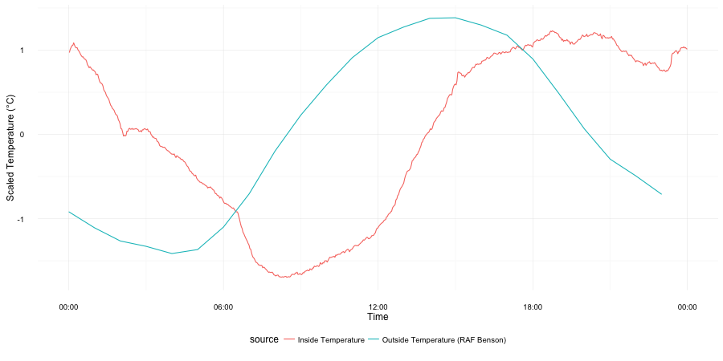
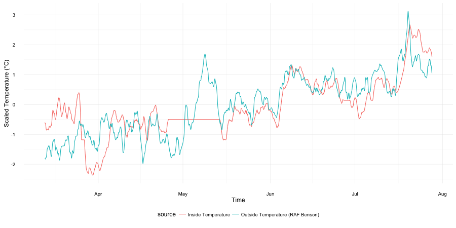
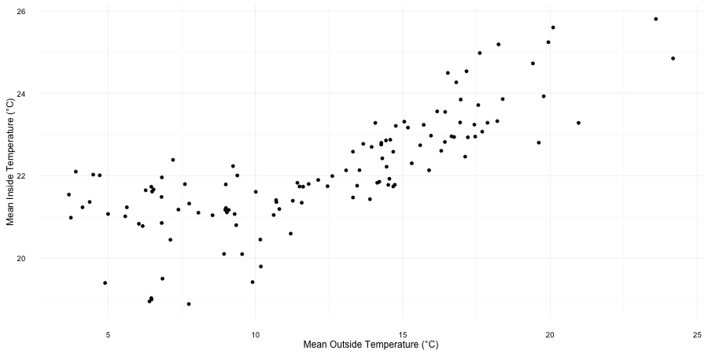

Tracking my room temperature with a data logger, inspired by [this reddit post](https://www.reddit.com/r/dataisbeautiful/comments/47xgos/how_cold_is_my_nyc_apartment_oc/).

# Hardware
[Elitech URC5](http://www.elitech.uk.com/temperature_logger/Elitech_USB_Temperature_Data_logger_RC_5_147.html) avaliable from [Amazon.co.uk](https://www.amazon.co.uk/dp/B00MQSCZF2/) for ~ £14 inc p&p.

# Software
In order to read data from the USB stick on to a mac osx computer drivers are required: both RC-5 and RC4&RC4H from [Elitech.co.uk](http://www.elitech.uk.com/software.html).
I set the logger to record the temperature every 2 minutes so it takes 44 days to fill up the recorder storage. The data is downloaded and converted to (a badly formatted) tab seperated variable file by the "Rc logger" software (in the tar with the drivers). I name the files as "temperature1.tsv", "temperature2.tsv" etc.

Plots were created in R with the packages data.table, lubridate, ggplot2, ggTimeSeries, and RColorBrewer.
```bash
Rscript plot_temperature.R
```

# External Data
To compare the recorded temperature inside my room to the outside temperature I used temperature from the nearest weather station with avaliable open data (UK Met Office Weather Open Data - RAF Benson). The data is hosted on the [Microsoft Azure Marketplace](https://datamarket.azure.com/dataset/datagovuk/metofficeweatheropendata) - registration is required but it is free and unlimited. The primary account key is kept in a file named 'config.R' in the same directory (censored by .gitignore here) with the following format:

```R
api.key <- "ExampleApiKey0908338"
```

# Results


At first glance it looks like my accomodation is doing a good job of sheltering me from the UK weather. The temperature inside is usually higher than outside and has much less variation. The only time the inside temperature drops below 20 degrees centrigrade is when I went away towards the end of March and turned down my radiator. Unfortunately towards the end of April the thermometer memory filled up and I forgot to empty it.

We can also plot temperature in a calendar fashion which helps in identifying weekly patterns. In this form the decrease in temperature whilst I was away and the missing data is more obvious.


You can see the data above has daily cycles as well as longer term trends. We can seperate these fluctuations to make things clearer. Looking at the scaled daily flucluations alone you can see that the inside temperature does fluctuate in a similar pattern to the outside temperature but with a time lag.


By plotting the scaled general trend without the noise of daily fluctuation you can more clearly see how the inside temperature tracks the outside temperature. However this effect seems stronger at higher temperatures. This could be expected as low outside temperatures can be componsated with heating but as I have no air conditioning higher temperatures outside can not be so easily counteracted.


By plotting mean daily outside vs inside temperature we can see that below ~10°C outside temperature the inside temperature is fairly independent and stable, but as the mean outside temperature increases above this the room temperature also increases in a linear fashion.


View the code at the [Github repo](https://github.com/daniel-wells/temperature-tracker).
