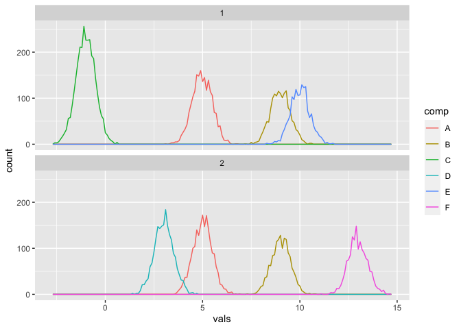
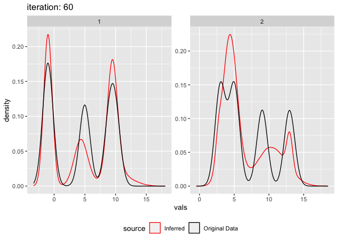

A mixture of gaussian distibutions can be used to approximate a
different non gaussian distribution. For example the hights of a
population may be non-normal, but are well approximated by a mixture of
two normal distributions which could represent the hights of sex.
Sometimes you might have multiple datasets (or a single dataset
segmented by some parameter) and you want to fit a gaussian mixture
model to all data sets at once but for there to be some components which
are shared across these data sets.

This is a vignette for an R package I created called [comixr](https://github.com/daniel-wells/comixr).

    library(comixr)
    library(data.table)

Simple Example
--------------

Let’s simulate two datasets, each with a common density at ~5 and with
some noise component with mean and variance unique to each dataset.

    input <- rbind(data.table(vals = rnorm(2000, mean = 5.0, sd = 0.75), seg = 1),
                   data.table(vals = rnorm(1000, mean = 0.5, sd = 1.0), seg = 1),
                  data.table(vals = rnorm(2000, mean = 5.5, sd = 0.75), seg = 2),
                  data.table(vals = rnorm(2000, mean = 4.0, sd = 3.0), seg = 2))

We need to specify our initial components for each component type:

    initial.parameters <- data.table(
      w = 0.5,
      mean = c(6,4),
      variance = 1,
      component.type = c("common","specific"))

    initial.parameters

    ##      w mean variance component.type
    ## 1: 0.5    6        1         common
    ## 2: 0.5    4        1       specific

Now we can fit the model:

    output <- fit_comixture(input, initial.parameters)

    ## [1] "2 segments, each with 1 common component(s), and 1 specific component(s)"
    ## [1] "Iteration: 1"
    ## [1] "Iteration: 2"
    ## [1] "Iteration: 3"
    ## [1] "Iteration: 4"
    ## [1] "Iteration: 5"
    ## [1] "Iteration: 6"
    ## [1] "Iteration: 7"
    ## [1] "Iteration: 8"
    ## [1] "Iteration: 9"
    ## [1] "Iteration: 10"
    ## [1] "Iteration: 11"
    ## [1] "Iteration: 12"
    ## [1] "Iteration: 13"
    ## [1] "Iteration: 14"
    ## [1] "Iteration: 15"
    ## [1] "Iteration: 16"
    ## [1] "Finished after 16 iterations (0.1 seconds)"

And plot the results:

    plot_comixture(input, output)

    plot_comixture(input, output, type = "density")

Multiple common and specific components
---------------------------------------

Lets simulate some example data, two data sets, each with four
components, two of which are shared across the data sets and two of
which are unique to the data set.

    test.data.basic <- rbind(
    # Common components
                data.table(comp = "A", vals = rnorm(2000, mean = 5, sd = 0.5), seg = 1),
                data.table(comp = "A", vals = rnorm(2000, mean = 5, sd = 0.5), seg = 2),

                data.table(comp = "B", vals = rnorm(1500, mean = 9, sd = 0.5), seg = 1),
                data.table(comp = "B", vals = rnorm(1500, mean = 9, sd = 0.5), seg = 2),

    # Unique components
                data.table(comp = "C", vals = rnorm(3000, mean = -1, sd = 0.5), seg = 1),
                data.table(comp = "D", vals = rnorm(2000, mean = 3, sd = 0.5), seg = 2),

                data.table(comp = "E", vals = rnorm(1500, mean = 10, sd = 0.5), seg = 1),
                data.table(comp = "F", vals = rnorm(1500, mean = 13, sd = 0.5), seg = 2)
                )

    knitr::kable(head(test.data.basic, 5))

<table>
<thead>
<tr class="header">
<th style="text-align: left;">comp</th>
<th style="text-align: right;">vals</th>
<th style="text-align: right;">seg</th>
</tr>
</thead>
<tbody>
<tr class="odd">
<td style="text-align: left;">A</td>
<td style="text-align: right;">5.314453</td>
<td style="text-align: right;">1</td>
</tr>
<tr class="even">
<td style="text-align: left;">A</td>
<td style="text-align: right;">5.772871</td>
<td style="text-align: right;">1</td>
</tr>
<tr class="odd">
<td style="text-align: left;">A</td>
<td style="text-align: right;">4.909807</td>
<td style="text-align: right;">1</td>
</tr>
<tr class="even">
<td style="text-align: left;">A</td>
<td style="text-align: right;">4.980014</td>
<td style="text-align: right;">1</td>
</tr>
<tr class="odd">
<td style="text-align: left;">A</td>
<td style="text-align: right;">4.325934</td>
<td style="text-align: right;">1</td>
</tr>
</tbody>
</table>

Let’s visualise the distribution of the two data sets broken down by
component

    library(ggplot2)

    ## Warning: package 'ggplot2' was built under R version 3.6.2

    ggplot(test.data.basic, aes(vals, colour = comp)) +
      geom_freqpoly(binwidth = 0.1) +
      facet_wrap(~seg, nrow = 2)

Fitting the model
-----------------

To fit a shared gaussian mixture model to this data we need to specify
the number of components in the model and the initial parameters for
each component. w is the mixing weight of each component, mu the mean,
and variance (*σ*2). By default comixr uses the EM algorithm,
but it can also use the VB.

    initial.parameters.basic.vb.1 <- data.table(
      mean = c(6,7,0.6,15),
      nu = c(0.1),
      scale = c(2^3),
      shape = c(2^(-4)),
      component.type = c("common","common","specific","specific"))

    initial.parameters.basic.vb.1

    ##    mean  nu scale  shape component.type
    ## 1:  6.0 0.1     8 0.0625         common
    ## 2:  7.0 0.1     8 0.0625         common
    ## 3:  0.6 0.1     8 0.0625       specific
    ## 4: 15.0 0.1     8 0.0625       specific

To fit the model pass the data (without the component labels), the
initial rho, and the other componentwise initial parameters to the
fit\_comixture() function.

    output.test.basic.vb.1 <- fit_comixture(test.data.basic[,.(vals,seg)], initial.parameters.basic.vb.1, max.iterations = 60, algorithm = "VB", quiet = TRUE)

    ## [1] "2 segments, each with 2 common component(s), and 2 specific component(s)"
    ## [1] "Finished after 60 iterations (0.6 seconds)"

We can then visualise the result using the plot\_comixture() function.

    plot_comixture(test.data.basic, output.test.basic.vb.1)

    plot_comixture(test.data.basic, output.test.basic.vb.1, type = "density")

    plot_comixture(test.data.basic, output.test.basic.vb.1, type = "QQ")

This is also a good case to demonstrate the failure of this algorithm.
Depending on the inital means the method can get stuck in a local
maxima. E.g. change the mean 0.6 to 0.4.

    initial.parameters.basic.vb.2 <- data.table(
      mean = c(6,7,0.4,15),
      nu = c(0.1),
      scale = c(2^3),
      shape = c(2^(-4)),
      component.type = c("common","common","specific","specific"))

    output.test.basic.vb.2 <- fit_comixture(test.data.basic[,.(vals,seg)], initial.parameters.basic.vb.2, max.iterations = 60, algorithm = "VB", quiet = TRUE)

    ## [1] "2 segments, each with 2 common component(s), and 2 specific component(s)"
    ## [1] "Finished after 60 iterations (0.7 seconds)"

    plot_comixture(test.data.basic, output.test.basic.vb.2)

    plot_comixture(test.data.basic, output.test.basic.vb.2, type = "density")

    plot_comixture(test.data.basic, output.test.basic.vb.2, type = "QQ")

If one of the input parameters is completely wrong e.g. if we change
mean of 15 to 150, an error will be produced.

    initial.parameters.basic.vb.3 <- data.table(
      mean = c(6,7,0.6,150),
      nu = c(0.1),
      scale = c(2^3),
      shape = c(2^(-4)),
      component.type = c("common","common","specific","specific"))

    output.test.basic.vb.3 <- fit_comixture(test.data.basic[,.(vals,seg)], initial.parameters.basic.vb.3, max.iterations = 60, algorithm = "VB")

    ## [1] "2 segments, each with 2 common component(s), and 2 specific component(s)"

    ## Error in VB(segment.indicies, read.count, rho, com.param, n.specific.components, : sum(specific_parameters$mix_weights == 0) == 0 is not TRUE

Non gaussian underlying data
----------------------------

The model can also be fitted to data which isn’t actually made from
multiple gaussians at all. Simulate realistic read count data using
negative binomial, 4 segments, 2 normal, 1 amp, 1 del. Parameters from
real data

    test.data.realistic <- rbind(
      data.table(comp = "A", vals = rnbinom(5000, size=2.7, mu = 16.5), seg = "normal.1"),
      data.table(comp = "A", vals = rnbinom(5000, size=3, mu = 36), seg = "amplified.1"),
      data.table(comp = "A", vals = rnbinom(5000, size=2.9, mu = 8.4), seg = "deleted.1"),
      data.table(comp = "A", vals = rnbinom(5000, size=2.7, mu = 16.5), seg = "normal.2"))

    initial.parameters.realistic <- data.table(
      w = c(0.5),
      mean = c(3,4,6,8,10,13,17,20,25,40,50,100,1,2),
      variance = c(8^2),
      component.type = c(rep("common",9),rep("specific",5)))

    output.realistic <- fit_comixture(test.data.realistic[,.(vals,seg)], initial.parameters.realistic, quiet = TRUE)

    ## [1] "4 segments, each with 9 common component(s), and 5 specific component(s)"
    ## [1] "Finished after 30 iterations (1.4 seconds)"

    plot_comixture(test.data.realistic, output.realistic)

    plot_comixture(test.data.realistic, output.realistic, type = "density")

